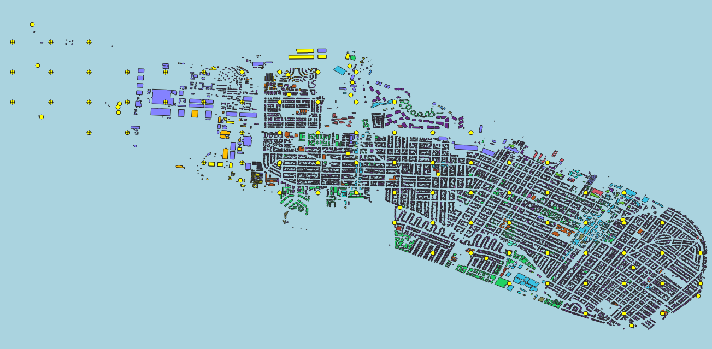
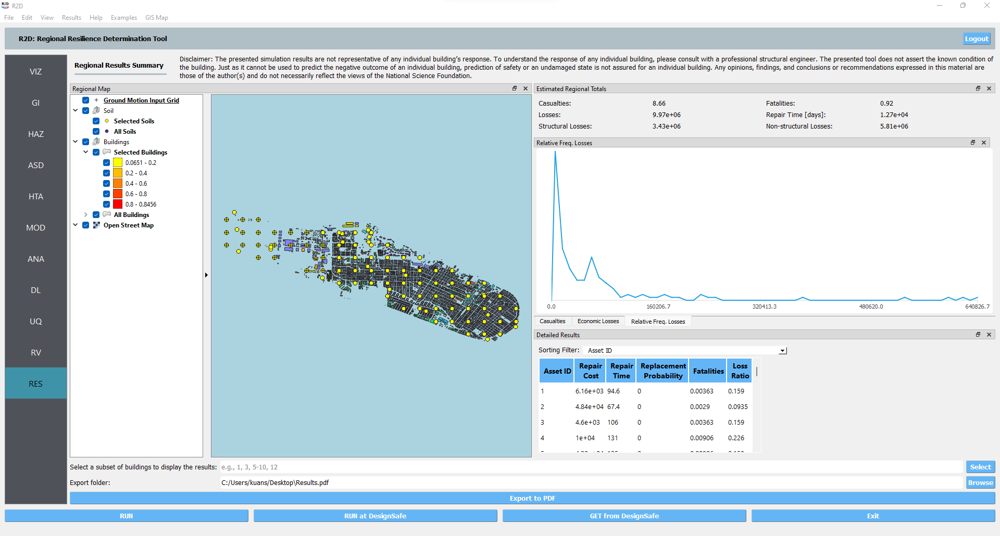
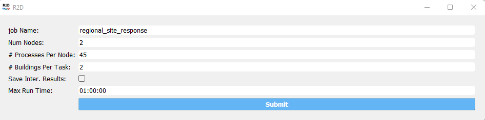

E10 - Site Response Analysis
============================

+-----------------+-----------------------------------------------------------------+
| Download files  | :examplesgithub:`Download <E10SiteResponse/>`                   |
+-----------------+-----------------------------------------------------------------+

This example presents regional earthquake impact analysis including site response analysis and building damage and loss assessment. Overall 177 sites are included for soil response simulation under bedrock ground motion input with a building inventory including approximately 14,000 buildings in the city of Alameda, CA.

#. Set the **Units** in the **GI** panel as shown in :numref:`r2d_gi_E10` and check interested output files.

   .. figure:: figures/r2dt-0010-GI.png
      :name: r2d_gi_E10
      :align: center
      :figclass: align-center
      :width: 500

      R2D GI setup.
#. Select the **Regional Site Response** method in the **HAZ** panel.
   In the ``Site`` input widget, the ``SiteModelData.csv`` should be automatically loaded, which includes the basic site information and modeling parameter.
   In the ``Soil Properties/Site Response Script`` widget, the modeling script should be automatically loaded which would create OpenSees tcl models for individual sites selected for analysis.
   In the ``Input Motions`` widget, the ``EventGrid.csv`` file as well as the input motion directory should be automatically loaded, which includes the ground acceleration time history data files.
   In the ``Units of Event Input File`` widget, the time history file ``TH_file`` has a unit of gravity acceleration and the scaling ``factor`` is unitless (these two fields are automatically created from the column headers in ``EventGrid.csv``).

   .. figure:: figures/r2dt-0010-HAZ.png
      :name: r2d_haz_E10
      :align: center
      :figclass: align-center
      :width: 500

      R2D HAZ setup.
#. **ASD** In the asset definition panel, the path to the ``all_bldgs.csv`` file is specified. Once this file is loaded, the user can select which 
   particular assets will be included in the analysis by entering a valid range in the form and clicking **Select**. 

   .. figure:: figures/r2dt-0010-ASD.png
      :name: r2d_asd_E10
      :align: center
      :figclass: align-center
      :width: 500

      R2D ASD setup.
#. **HTA** Next, a hazard mapping algorithm is specified using the **Nearest Neighbor** method, which is configured as shown in the following figure with **4** samples in **4** neighbors.

   .. figure:: figures/r2dt-0010-HTA.png
      :name: r2d_hta_E10
      :align: center
      :figclass: align-center
      :width: 500

      R2D HTA setup.
#. **MOD** In the modeling panel, the **MDOF-LU** method is used to create Multi-Degree-Of-Freedom (MDOF) nonlinear shear building model from the input building file in **ASD**. 
   Following the HAZUS EQ Technical Manual Chapter 5, a hysteretic nonlinear material is defined for each story with a story shear and displacement relationship with the initial stiffness, 
   over-strength ratio, hardening ratio, and degradation factor. These parameters are stored in the ``HazusData.txt`` for different building design levels (e.g., high-, moderate-, or pre-code) 
   which is now primarily based on the built year of the structure.

   .. figure:: figures/r2dt-0010-MOD.png
      :name: r2d_mod_E10
      :align: center
      :figclass: align-center
      :width: 500

      R2D MOD setup.
#. Set the "Building Analysis Engine" in **ANA** panel to "OpenSees". 

   .. figure:: figures/r2dt-0010-ANA.png
      :name: r2d_ana_E10
      :align: center
      :figclass: align-center
      :width: 500

      R2D ANA setup.
#. **DL** The damage and loss panel is now used to configure the **Pelicun3** backend. The **HAZUS MH EQ Story** damage and loss method is selected and configured as shown in the following figure:

   .. figure:: figures/r2dt-0010-DL.png
      :name: r2d_dl_E10
      :align: center
      :figclass: align-center
      :width: 500

      R2D DL setup.
#. Set the "UQ Application" in **UQ** panel to "Dakota". 

   .. figure:: figures/r2dt-0010-UQ.png
      :name: r2d_uq_E10
      :align: center
      :figclass: align-center
      :width: 500

      R2D UQ setup.

After setting up the simulation, please click the **RUN** to execute the analysis. Once the simulation completed, 
the app would direct you to the **RES** panel (:numref:`r2d_res_E10`) where you could examine and export the results.

   R2D RES panel.

For simulating the damage and loss for a large region of interest (please remember to reset the building IDs in **ASD**), it would be efficient to submit and run the job 
to `DesignSafe <https://www.designsafe-ci.org/>`_ on on `Frontera <https://tacc.utexas.edu/systems/frontera/>`_. 
This can be done in R2D by clicking **RUN at DesignSafe** (one would need to have a valid 
`DesignSafe account <https://www.designsafe-ci.org/account/register/>`_ for login and access the computing resource). 
:numref:`r2d_run_ds_E10` provides an example configuration to run the analysis (and please see `R2D User Guide <https://nheri-simcenter.github.io/R2D-Documentation/common/user_manual/usage/desktop/usage.html#figremjobpanel>`_ for detailed descriptions).
The individual site response analysis and building damage and loss simulation are paralleled on Stampede2. It is suggested for this demoed example to use 60 minutes with 96 Skylake (SKX) cores (e.g., 2 nodes with 48 processors per node) to complete 
the simulation. One would receive a job failure message if the specified CPU hours are not sufficient to complete the run. 
Note that the product of node number, processor number per node, and buildings per task should be greater than the total number of sites/buildings in the inventory to be analyzed.

   R2D - Run at DesignSafe (configuration).

Users could monitor the job status and retrieve result data by **GET from DesignSafe** button (:numref:`r2d_get_ds`). The retrieved data include
four major result files, i.e., *IM.hdf*, *BIM.hdf*, *EDP.hdf*, *DM.hdf*, and *DV.hdf*. R2D also automatically converts the hdf files to csv files that are easier to work with.
While R2D provides basic visualization functionalities (:numref:`r2d_res_E10`), users could access the data which are downloaded under the remote work directory, e.g., 
*/Documents/R2D/RemoteWorkDir* (this directory is machine specific and can be found in **File->Preferences->Remote Jobs Directory**).
Once having these result files, users could extract and process interested information - the next section will use 
the results from this testbed as an example to discuss more details.

