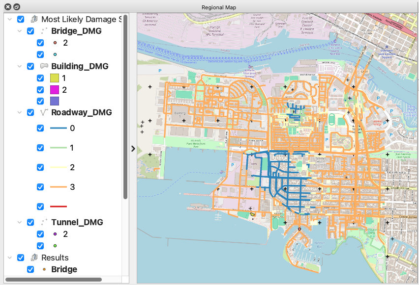

E14 - Basic HAZUS Transportation Infrastructure
===============================================

+-----------------+------------------------------------------------------------+
| Download files  | :examplesgithub:`Download <E14BasicHAZUSTransportation/>`  |
+-----------------+------------------------------------------------------------+

This earthquake example demonstrates rapid analysis capabilities with the HAZUS earthquake damage and loss assessment methodology for transportation infrastructure, as well as evaluating the distruance to the transportation network using traffic flow simulations. Asset-level Damage and Losses (D&L) are calculated directly from Intensity Measures (IM) for buildings, highway bridges, highway tunnels, and roadways. The IM field that represents ground shaking intensity measures in Alameda Island, CA, from a Mw7.05 event on the Hayward fault was obtained from Probabilistic Seismic Hazard Analysis (PSHA). The liquefaction-induced ground failure intensity measures (Permanent Ground Deformation) are calculated following the method proposed by Wang, C., Wang, D., & Chen, Q. (2021). Regional Evaluation of Liquefaction-Induced Lateral Ground Deformation for City-Scale Transportation Resilience Analysis. Journal of Infrastructure Systems, 27(2), 04021008. The traffic flow simulation is performed using the Residual Demand Model that is originally developed in Zhao, B., Kumar, K., Casey, G., & Soga, K. (2019). Agent-based model (ABM) for city-scale traffic simulation: A case study on San Francisco. In International Conference on Smart Infrastructure and Construction 2019 (ICSIC) Driving data-informed decision-making (pp. 203-212). ICE Publishing.

This study will be defined by sequentially traversing the input panels of the **R2D** interface. However, as outlined in the online user manual, these procedures can be serialized to and loaded immediately from a JSON file, which for this example may be found :examplesgithub:`here <E14BasicHAZUSTransportation/input.json>`.

#. **VIZ** The visualization panel in the following figure shows the location of the assets considered in this example.

   .. figure:: figures/r2dt-0014-VIZ.png
      :width: 600px
      :align: center

#. **GI** The unit system and asset type are prescribed in this panel. We select both Buildings and Transportation Network as asset types, and we are interested in the **building engineering demand parameters**, **damage measures**, and the resulting **decision variables**.

   .. figure:: figures/r2dt-0014-GI.png
      :width: 600px
      :align: center

#. **HAZ** Next, the hazard panel is used to load the event grid ``.csv`` file (:examplesgithub:`view on Github <E14BasicHAZUSTransportation/input_data/IMs/EventGrid.csv>`), which lists out the ground motions, which are used as the seismic hazard inputs in this example.

   .. figure:: figures/r2dt-0014-HAZ.png
      :width: 600px
      :align: center

#. **ASD** In the asset definition panel, the path to the :examplesgithub:`all_bldgs.csv <E14BasicHAZUSTransportation/input_data/all_bldgs.csv>` file is specified for buildings. For transportation infrastructure, the path to the :examplesgithub:`AI_hwy_inventory.geojson <E14BasicHAZUSTransportation/input_data/AI_hwy_inventory.geojson>` file is specified. Once this file is loaded, the user can select which particular assets to include in the analysis by entering a valid range (e.g., 1-50) in the form and clicking **Select**. The ``all_bldgs.csv`` and ``AI_hwy_inventory.geojson`` files include parameters for the damage and loss assessment (e.g., number of stories, year of built, occupancy class, structure type, and plan area) for the buildings and transportation infrastructure in the community.

   .. figure:: figures/r2dt-0014-ASD-building.png
      :width: 600px
      :align: center
   .. figure:: figures/r2dt-0014-ASD-transport.png
      :width: 600px
      :align: center

#. **HTA** Next, a hazard mapping algorithm is specified using the **Nearest Neighbor** method, which is configured as shown in the following figure with **100** samples in **4** neighbors, i.e., randomly sampling 100 ground motions from the nearest Ground Motion Grid points(each grid point has 1000 intensity measure realizations as specified in the **HAZ**).

   .. figure:: figures/r2dt-0014-HTA.png
      :width: 600px
      :align: center

#. **MOD** panel is not used for this procedure. The **Building Modeling** dropdown and **Transportation Components Modelling**should be left set to **None**.

   .. figure:: figures/r2dt-0014-MOD.png
      :width: 600px
      :align: center

#. **ANA** In the analysis panel, **IMasEDP** is selected from the primary dropdown for both Buildings and Transportation Network.

   .. figure:: figures/r2dt-0014-ANA.png
      :width: 600px
      :align: center

#. **DL** The damage and loss panel is now used to configure the **Pelicun** backend. The **HAZUS MH EQ IM** damage and loss method is selected and configured as shown in the following figure for both Buildings and Transportation Network. 

   .. figure:: figures/r2dt-0014-DL.png
      :width: 600px
      :align: center

#. **SP** The damage and loss panel is used to configure the **Residual Demand Traffic Simulation**. The details of the input fields are described at :ref:`SP: Residual Demand Traffic Simulator <lbl-SPResidualDemand>`. The roadway edges and nodes geojson files are produced using SimCenter's BRAILS tool. The pre-event traffic demand is extracted from the travel demand estimated by the SF Bay Area MTC, which is openly available at `here <https://data.mtc.ca.gov/data-repository/>`_. The post-event traffic demand is estimated by randomly sampling 80% of the pre-event traffic demand. The traffic simulation is performed for the morning rush hour (7:00-9:00 AM).

   .. figure:: figures/r2dt-0014-SP.png
      :width: 600px
      :align: center

#. **UQ** For this example the **UQ** dropdown box should be set to **None**.

   .. figure:: figures/r2dt-0014-UQ.png
      :width: 600px
      :align: center
	  
#. **RV**

   The random variable panel will be left empty for this example.

