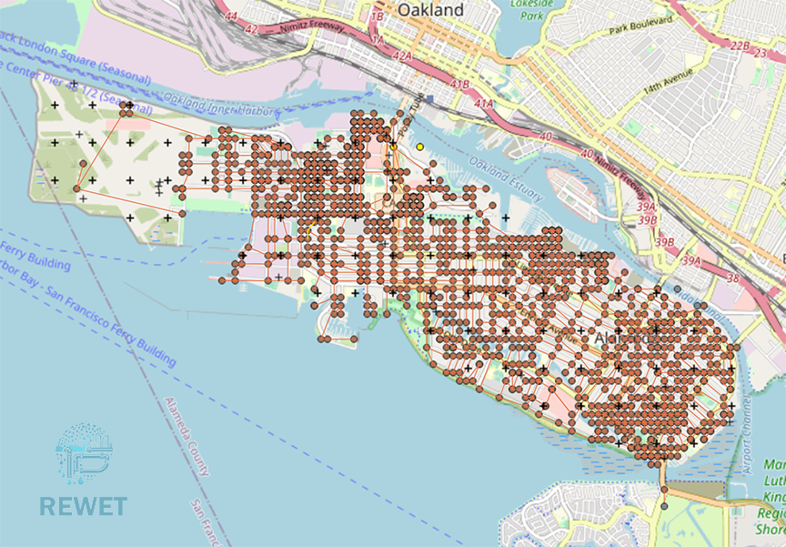

E15 - Water Distribution Network and Performance Assessment
===========================================================

+-----------------+------------------------------------------------------------+
| Download files  | :examplesgithub:`Download <E15WDNRecoveryAndPerformanceAssessment/>`  |
+-----------------+------------------------------------------------------------+

This example demonstrates the performance assessment of water distribution systems using REWET. REWET is designed to evaluate the functionality of a water distribution system following catastrophic events that cause damage to the infrastructure. The method is outlined in the dissertation by Naeimi Dafchahi, S., & Davidson, R. A. (2023), titled "Post-event restoration simulation of water distribution systems: a generally applicable approach."

For the purposes of this example, we will consider an earthquake as the baseline hazard type. REWET assesses the recovery and functionality of the system over the time. To achieve this, users must specify general rules (also known as restoration policy) for system recovery. While R2D's flexible workflow handles hazard intensity measure calculations and damage estimation, users are responsible for providing other necessary inputs for the recovery process and simulation.

   
In the following steps, we will guide you through each stage of the assessment. However, as outlined in the online user's manual, these procedures can be serialized to and loaded immediately from a JSON file, which for this example may be found :examplesgithub:`here <E15WDNRecoveryAndPerformanceAssessment/input.json>`. We can open the input.json file using R2D so that the following panels are set.

#. **VIZ** The visualization panel in the following figure shows the location of the assets considered in this example.

   .. figure:: figures/r2dt-0015-VIZ.png
      :width: 800px
      :align: center

#. **GI** Generally, the unit system and asset type are prescribed in this panel. However, in this example, we use an INP file for the WDN input and the unit specified in the INP file. We are considering Water Distribution Network as asset types, and we are interested in the **engineering demand parameters**.

   .. figure:: figures/r2dt-0015-GI.png
      :width: 800px
      :align: center
	  
#. **HAZ** In our assessment of water distribution system performance, we utilize the **Regional Earthquake Event Generation tool** from the Regional Resilience Determination (R2D) Tool. This specific tool allows us to generate intensity measures (IMs) for earthquake events. The usage of the tool is explained :ref:`here<ground_motion_tool>`, so we won't go into explaining the details. Once we have created these IM values using the tool, we can employ them for damage estimation within the R2D framework.

		.. note:: Alternatively, users have the flexibility to provide IM values generated by other models, as long as they adhere to an acceptable format.
		.. note:: Units are set according to the explanation in the Regional Earthquake Event Generation tool :ref:`documentation<ground_motion_tool>`.

	.. figure:: figures/r2dt-0015-HAZ.png
	  :width: 800px
	  :align: center

#. **ASD** A Water Distribution Network (WDN) consists of pipes, pumps, tanks, valves, and junctions (also known as nodes). This information can be provided in many formats, but the **EPANET** file format (**INP**) is widely used in the industry and research. Thus, REWET uses this format for input. Consequently, the INP to GEOJSON tool is selected to translate the INP file to the R2D internal format. Then, the path to the INP file must be provided. Since the INP file format does not contain projection system information, the projection system must be defined by the user. This projection system aligns with the coordinates defined for the system components in the INP file. Furthermore, the user may select the assets for which the loss estimation will be performed using the filter functionality.

		.. note:: We enter **1** in the filter value for junction and reservoir since the damage to those is not being modeled for this example. Also, we enter **1-200** to limit the damage modeling to the first 200 pipes in our asset list, so that the damage modeling is kept short.

	.. figure:: figures/r2dt-0015-ASD.png
	  :width: 800px
	  :align: center
	  
#. **HTA** In the 'Hazard to Asset' tab, the user specifies the method for hazard mapping. We select the **Nearest Neighbor** method. Next, we provide the number of IM samples, and the number of neighbors from which the values are assessed at each asset's location, as shown in the following figure. We leave the random seed as it is.

   .. figure:: figures/r2dt-0015-HTA.png
      :width: 800px
      :align: center
	
#. **MOD** We do not model any element of the WDN. Thus, we select **None** from the dropdown menu on **Water Distribution Network Modeling**.

   .. figure:: figures/r2dt-0015-MOD.png
      :width: 800px
      :align: center

#. **ANA** In the analysis panel, **IMasEDP** is selected from the primary dropdown for the Water Distribution Network.

   .. figure:: figures/r2dt-0015-ANA.png
      :width: 600px
      :align: center

#. **DL** We selected **PELICUN** for damage modeling in the context of WDN (Water Distribution Network) systems. Since the damage estimates rely on IM (Intensity Measure) values, we employ the HAZUS MH EQ IM method. The sample size specifies the number of damage samples. For the remaining aspects, we maintain them as they are.

   .. figure:: figures/r2dt-0015-DL.png
      :width: 800px
      :align: center

#. **SP** In the context of System Performance, we opt for REWET Recovery to execute evaluations of Water Distribution Network (WDN) performance. Within the REWET Recovery widget, the inputs are categorized into three tabs: Simulation, Hydraulics, and Restoration.

	* **Simulation Tab**

		**Event Time:** This refers to the time of the event after the simulation starts. For instance, if the time in the example INP file is 12 AM, an event time equal to 7200 corresponds to 2 AM. 
		
		**Simulation End Time:** This specifies the time at which the simulation ends.
		
		**Terminate Simulation after the Last Job Sequence Is Done:** This option ends the simulation before the simulation end time is reached, provided that all the jobs defined for recovery are completed.
		
		**Terminate Simulation after the Demand Is Met:** With this setting, the simulation ends before the simulation end time is reached if the ratio of demand after the event to the demand before the event meets or exceeds a given threshold for all demand nodes.
		
		**Demand Checking Time Window:** This parameter defines the time window for checking demand after selecting "Terminate Simulation after the Demand."
		
		**Demand Checking Criteria:** This shows the ratio of demand after to demand before, which determines when the simulation ends when "Terminate Simulation after the Demand" is selected.

			.. figure:: figures/r2dt-0015-SP-Sim.png
			   :width: 800px
			   :align: center
	
	* **Hydraulic Tab**

		**Hydraulic Solver Selection:** We choose the Modified EPANET V2.2 is a customized version of EPANET V2.2 that handles flow from negative pressure scenarios.
		
		**Minimum Pressure Override and Required Pressure Override:** These options allow users to override the minimum and required pressure values specified in the INP file. Since the minimum and required pressure values in the example are correct, we leave them unchanged (i.e., set as -1 so that they will be ignored).
		
		**Pipe Damage Modeling:** In pipe damage modeling, the relationship between the pipe's diameter and the equivalent orifice diameter - similar to the approach proposed by Shi and O'Rourke (2008) - for each pipe material (or damage type) is defined. The default value is set to Cast Iron, with average values derived from Shi and O'Rourke (2008). We have not provided material or the damage modeling based on the material, so that R2D assumes the default value which is Cast Iron.

			.. figure:: figures/r2dt-0015-SP-Hyd.png
			   :width: 800px
			   :align: center
		  
	* **Restoration Tab**

		**Restoration On:** When checked, this indicates that REWET runs the restoration (recovery) simulation.
		
		**Policy Definition File:** This file defines restoration policies according to REWET's policy definition format.
		
		**Minimum Job Time:** Specifies the time when a job is assigned to a restoration agent before their shift ends.
		
		**Pipe Discovery Rules for Damaged Assets:** The user can define the discovery rules for each damaged asset. For a pipe, the discovery can be based on leaks or on a user-specified time series of the discovery ratio. Leak-based discovery helps the user mimic the discovery of buried pipes, in which the pipes are not discovered unless the damage location on the pipe is pressurized for enough time so that the water flows out to the surface of the ground. The user-specified method may also be beneficial to the user when other methods for discovery are used, or the user prefers such a model. Other possible damage discoveries are node-level damage discovery, tank, and pump damages. Based on the available REWET and R2D versions, damage modeling of these asset types (also known as elements) may be included or not. If such damage modeling is being performed, the user may define such an element's discovery as well.

		   .. figure:: figures/r2dt-0015-SP-Res.png
			  :width: 800px
			  :align: center

#. **UQ** For this example the UQ dropdown box should be set to None

   .. figure:: figures/r2dt-0015-UQ.png
	  :width: 800px
	  :align: center

#. **UQ** The random variable panel will be left empty for this example.

   .. figure:: figures/r2dt-0015-RV.png
	  :width: 800px
	  :align: center

#. **Result** This tab is designed to provide general results to the user. A power user may utilize the raw data provided by R2DTool to produce the specific data they need. Results for a water distribution network performance assessment can be shown using metrics such as Basic Service Categories. Water Delivery and Water Quality are two metrics that can be selected, and the system's performance at each time step will be displayed in the R2D results tab.

Furthermore, the pipes and junction data, including the total amount of time each junction is out of service for each metric (i.e., the total amount of time a junction is either not delivering any water (Water Delivery) or not delivering the expected amount of water (Water Quality), are shown in a tabular format. The data is also available in the GIS gadget in central section of the map.

   .. figure:: figures/r2dt-0015-SP-Result.png
	  :width: 800px
	  :align: center
