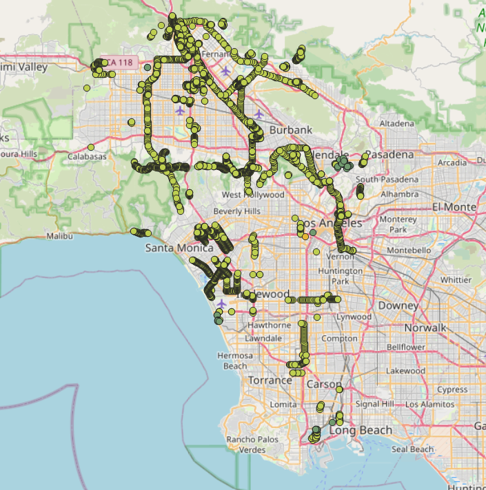

E16 - Power Damage Assessment Under Earthquake Harzard
===============================================

+-----------------+------------------------------------------------------------+
| Download files  | :examplesgithub:`Download <E16PowerEQHAZUS/>`  |
+-----------------+------------------------------------------------------------+

This example demonstrates the damage assessment of electrical power network due to ground shaking and failure caused by earthquake using the HAZUS methodology.
To achieve this, use data that are already provided from BRAILS. The event data is generated using the Regional Earthquake Event Generation tool.
The damage assessment is performed using the PELICUN damage model - inline with HAZUS methodology.

   
In the following steps, we will guide you through each stage of the assessment. However, as outlined in the online user's manual, these procedures can be serialized
to and loaded immediately from a JSON file, which for this example may be found :examplesgithub:`here <E16PowerEQHAZUS/input.json>`. We can open the input.json file using R2D so that the following panels are set.

#. **VIZ** The visualization panel in the following figure shows the location of the assets considered in this example.

   .. figure:: figures/r2dt-0016-VIZ.png
      :width: 800px
      :align: center

#. **GI** Generally, the unit system and asset type are prescribed in this panel. However, in this example, we use an INP file for the WDN input and the unit specified in the INP file. We are considering Water Distribution Network as asset types, and we are interested in the **engineering demand parameters**.

   .. figure:: figures/r2dt-0016-GI.png
      :width: 800px
      :align: center
	  
#. **HAZ** In our assessment of electrical power network, we utilize the **Regional Earthquake Event Generation tool** from the Regional Resilience Determination (R2D) Tool. This specific tool allows us to generate intensity measures (IMs) for earthquake events (e.g., PGA, PGD due to liquifaction, etc.). The usage of the tool is explained :ref:`here<ground_motion_tool>`, so we won't go into explaining the details. Once we have created these IM values using the tool, we can employ them for damage estimation within the R2D framework.

		.. note:: Alternatively, users have the flexibility to provide IM values generated by other models, as long as they adhere to an acceptable format.
		.. note:: Units are set according to the explanation in the Regional Earthquake Event Generation tool :ref:`documentation<ground_motion_tool>`.

	.. figure:: figures/r2dt-0016-HAZ.png
	  :width: 800px
	  :align: center

#. **ASD** An electrical power network consists of generation, subtations, distribution/transfer towers in teh HAZUS methodology. Consequently, GEOJSON to Asset tool is selected to translate such information, provided by BRAILS, to assets for R2D tool in its backend.

	.. figure:: figures/r2dt-0016-ASD.png
	  :width: 800px
	  :align: center
	  
#. **HTA** In the ‘Hazard to Asset’ tab, the user specifies the method for hazard mapping. We select the **Nearest Neighbor** method. Next, we provide the number of IM samples, and the number of neighbors from which the values are assessed at each asset’s location, as shown in the following figure. We leave the random seed as it is.

   .. figure:: figures/r2dt-0016-HTA.png
      :width: 800px
      :align: center
	
#. **MOD** We do not modle teh response of any of teh asset elements in electrical power network damage assesment due to earthquake. Thus, we select **None** from the dropdown menu on **Power Network Modeling**.

   .. figure:: figures/r2dt-0016-MOD.png
      :width: 800px
      :align: center

#. **ANA** In the analysis panel, **IMasEDP** is selected from the primary dropdown for the Water Distribution Network.

   .. figure:: figures/r2dt-0016-ANA.png
      :width: 600px
      :align: center

#. **DL** We selected **PELICUN** for damage modeling in the context of WDN (Water Distribution Network) systems. Since the damage estimates rely on IM (Intensity Measure) values, we employ the HAZUS MH EQ IM method. The sample size specifies the number of damage samples. For the remaining aspects, we maintain them as they are.

   .. figure:: figures/r2dt-0016-DL.png
      :width: 800px
      :align: center

#. **SP** We do not use the **System Performance** for thsi example as this example is only about the damage assessment. Thus, we select **None** from the dropdown menu.

	   .. figure:: figures/r2dt-0016-SP.png
	  :width: 800px
	  :align: center

#. **UQ** For this example the UQ dropdown box should be set to None

   .. figure:: figures/r2dt-0016-UQ.png
	  :width: 800px
	  :align: center

#. **UQ** The random variable panel will be left empty for this example.

   .. figure:: figures/r2dt-0016-RV.png
	  :width: 800px
	  :align: center

#. **Result** This tab is designed to provide general results to the user. A power user may utilize the raw data provided by R2DTool to produce the specific data they need. Results for electrical power damage assessemnt due to mean state of the assets.

   .. figure:: figures/r2dt-0016-RES.png
	  :width: 800px
	  :align: center
