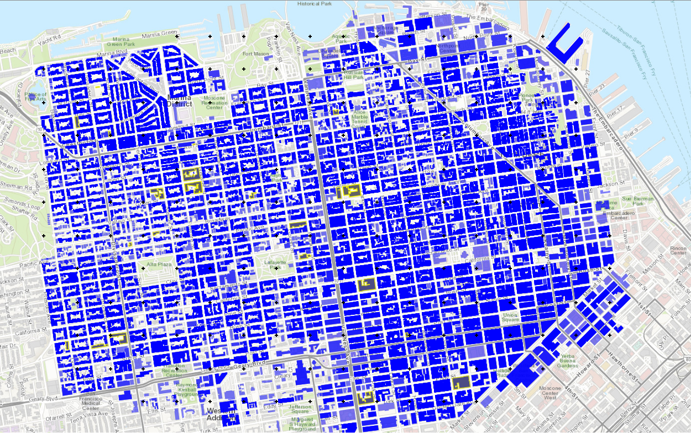

E1 - Basic HAZUS
===========================

+-----------------+---------------------------------------------+
| Download files  | :examplesgithub:`Download <E1BasicHAZUS/>`  |
+-----------------+---------------------------------------------+

This earthquake example demonstrates rapid analysis capabilities with the HAZUS earthquake damage and loss assessment methodology. Building-level Damage and Losses (D&L) are calculated directly from Intensity Measures (IM) for **25** assets. The IM field that represents peak ground acceleration in the city of San Francisco, CA, from a Mw7.2 event on the San Andreas fault, and was obtained from a Probabilistic Seismic Hazard Analysis (PSHA).

The following **11** items describe the options presented once the example is loaded from the tool menu, or if tif the **input.json** file is loaded, after it has been downloaded them from the examples :examplesgithub:`github page <E1BasicHAZUS/>` along with the other files and directories there. These options correspond to the input panels accessible through the ribbon of buttons on the left side of the application.

#. **VIZ** The visualization panel is in actuality the `QGIS <https://qgis.org/>`_ application running inside our application. When this example is loaded, QGIS displays three layers: (1) the ground motion grid, (2) the buildings, and (3) the basemap, which defaults to Google Street maps. Users may toggle these layers on or off, switch basemaps, and query objects by selecting the **Identify** button and clicking on a grid point or building.

   .. figure:: figures/r2dt-0001-VIZ.png
      :width: 600px
      :align: center

.. note::

   Because the **QGIS** application is running inside R2D, any of the things the user can do with QGIS via the icons at the top of the visualization of the region, they can do inside this R2D window. Using this functionality, will neither **break** nor **alter** the workflow defined by the options the user changes when other input panels are selected.

#. **GI** The workflow units, asset types and outputs to be studied are prescribed in this panel. The panel as shown in figure below, shows the units are set for the imperial system, that only **building** assets have been selected as the asset types to be considered in the workflow, and that the user is interested in the **engineering demand parameters**, **damage measures**, and the resulting **decision variables** for the output.

   .. figure:: figures/r2dt-0001-GI.png
      :width: 600px
      :align: center

#. **HAZ** Next, the hazard panel. For this example, the **User Specified Ground Motions** option is selected to input the IM field, a series of peak ground accelerations obtained from the PSHA. The input file, :examplesgithub:EventGrid.csv <E1BasicHAZUS/input_data/San_Andreas_Mw72_filtered/EventGrid.csv>, lists filenames, longitudes, and latitudes:

+---------------+-------------+-----------+
| GP_file       | Longitude   | Latitude  |
+===============+=============+===========+
| Site_1051.csv | -122.4474   | 37.7935   |
+---------------+-------------+-----------+
| Site_1052.csv | -122.4474   | 37.7958   |
+---------------+-------------+-----------+
| ...           | ...         | ...       |
+---------------+-------------+-----------+

The corresponding file for each long, lat contains over **1000** PGA values for the corresponding long, lat.

   .. figure:: figures/r2dt-0001-HAZ.png
      :width: 600px
      :align: center

	      
#. **ASD** In the asset definition panel, the **CVStoAIM** option is used to provide information on the assets. Two inputs are required: 1) The path to the csv file, :examplesgithub:`SanFranciscoBuildings.csv <E1BasicHAZUS/input_data/SanFrancisco_buildings.csv>`, another csv file containing information on all the buildings in the region. The files contains **id,Latitude,Longitude,PlanArea,NumberOfStories,YearBuilt,ReplacementCost,StructureType,OccupancyClass,Footprint** and 2) the range of assets to be analyzed. In the figure only buildings **8000-8024** have only been selected.

   .. note::

      1. The range of assets uses the id's of the buildings provided in the asset inventory file.
      2. By defauult **NO ASSETS** will be analyzed unless the range is filled in.
      3. The user can provide a comma seperated list of assets that includes ranges, e.g. 1,2,3,5-10,100-1000.
      2. Once the range has been filled in, the user can view the selected buildings by going to the **VIZ** panel, looking at the buildings layer and selecting the **Selected Buildings**, and de-selecting **All Buildings**.
      3. If user does not like the selections, the **Clear Selections** button in the ASD panel can be pressed.

   .. figure:: figures/r2dt-0001-ASD.png
      :width: 600px
      :align: center

#. **HTA** Next, a hazard mapping algorithm is specified. Of the **3** options provided, only the **Nearest Neighbor** method option makes sense for the **Hazard** application chosen, one in which the event is specified at a grid of points. For the input shown in the following figure with **100** samples in **4** neighbors, i.e., randomly sampling 100 ground motions from the nearest four stations (each station has a large number of ground motion records specified in the **HAZ**).

   .. figure:: figures/r2dt-0001-HTA.png
      :width: 600px
      :align: center

#. **MOD** The **Asset Modeling** dropdown should be set to **None**. For a Hazus-level evaluation, no finite element models are required; engineering demand parameters are derived directly from ground motion intensity.

   .. figure:: figures/r2dt-0001-MOD.png
      :width: 600px
      :align: center

#. **ANA** In the analysis panel, **IMasEDP**, Intensity Measure as Engineering Demand Parameter, is selected from the dropdown. As mentioned previously, for a Hazus level evaluation no finite element analysis needs to be performed as the engineering demand parameters can be determined from the intensity of the ground motions alone.

   .. figure:: figures/r2dt-0001-ANA.png
      :width: 600px
      :align: center

#. **DL** For the damage and loss panel, the **Pelicun3** option is selected. In the panel presented for Damage and Loss Method, the **Hazus Earthquake - Buildings ** option should be selected. In addition the **sample size**, the **number of loss** realizations to be performed by Pelicun should be set to **100**.

   .. figure:: figures/r2dt-0001-DL.png
      :width: 600px
      :align: center

#. **UQ** For this example the **UQ** dropdown box should be set to **None**. For this workflow, uncertainty is specified in the **NearestNeighbour** and **Pelicun** options. 

   .. figure:: figures/r2dt-0001-UQ.png
      :width: 600px
      :align: center
	  
#. **RV** This panel remains empty, i.e. no random variables are added, for the example.

#. **RES**

   Once the user has run the example, by using the **RUN** button, or the **RUN at DesignSafe** and **Get from DesignSafe** buttons, the results panel will be automatically shown. In the **Buildings** tab are two windows, which can both be seperated from the main application. The first displays the QGIS window now showing should the **VIZ** panel be selected, to which a new **layer** has been added, the **Resulta** layer and by delselecting the other layers in this QGIS window, the most likely damage state for the 25 buildings (buildings 8000-8024 in the **ASD** panel) selected to be analyzed can be reviewed. The second window shows, in tabular form, the results for each building. By left or right clicking in any of the columns of the table, statistical data for the entries, e.g. min, max, mean, mode and histograms, may be obtained.
   
   .. figure:: figures/r2dt-0001-RES.png
      :width: 600px
      :align: center   
