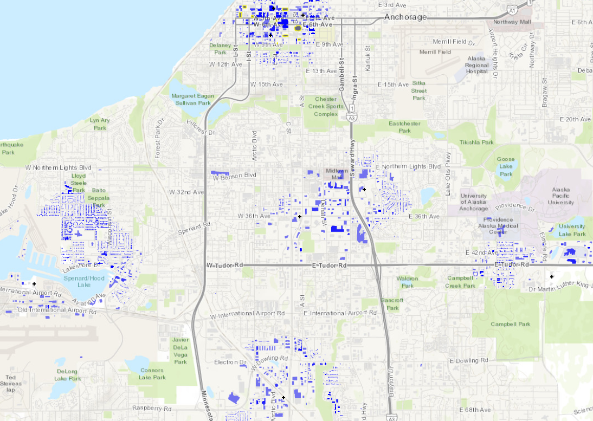

E2 - MDOF Building Response
===========================

+-----------------+-------------------------------------------------------+
| Download files  | :examplesgithub:`Download <E2MDOFBuildingResponse/>`  |
+-----------------+-------------------------------------------------------+

This example uses ground motions from the 2018 earthquake in Anchorage, AK, to characterize the response of buildings with an idealized MDOF building model through story-level Engineering Demand Parameters (EDP). Exploiting the refinement in EDPs, a HAZUS-based story-level assessment is employed to evaluate the performance of 5 buildings.
The results presented herein are only for demonstrating the use of R2DTool and do not serve as an accurate representation of the real losses resulting from the earthquake.

, suggesting a density of notable sites or data points within the city grid.
   :align: center

#. **VIZ** The visualization pane highlighting the assets available in this example.

   .. figure:: figures/r2dt-0002-VIZ.png
      :width: 600px
   :alt: A screenshot of a Geographic Information System (GIS) application interface. The main window displays a map with various overlaid data points and layers, indicating features such as buildings and ground motion in an area resembling a city. The left panel of the interface shows various tool and layer options, including options for adding a basemap and managing data sources such as GeoPackage, PostgreSQL, and ArcGIS REST Servers. The top toolbar contains standard GIS tools for map navigation and data analysis. Various file, edit, and view menus are also visible, along with a scale bar and coordinate display at the bottom of the map view.
      :align: center

#. **GI** First, the unit system and asset type are prescribed in this panel, and we're interested in the building engineering demand parameters, damage measures, and the resulting decision variables.

   .. figure:: figures/r2dt-0002-GI.png
      :width: 600px
   :alt: Screenshot of a user interface for a software application related to structural analysis. It features a section labeled "General Information" with fields for "Analysis Name," where "E2 - MDOF Building Response" is entered, and dropdowns for "Units" with "Force" in Kips, "Length" in Feet, and "Time" in Seconds. Another section titled "Asset Layers" shows options like "Buildings" checked, while "Soil," "Gas Network," "Water Network," "Waste Network," and "Transportation Network" are unchecked. Below, under "Output Settings," options such as "Engineering demand parameters (EDP)," "Damage measures (DM)," and "Decision variables (DV)" are checked, along with others related to output sampling and models. On the left side, there is a vertical navigation menu with various tabs like "VIZ," "GI," "HAZ," and others, but the content they relate to is not visible in the image.
      :align: center

#. **HAZ** 12 recorded ground motions across Anchorage (from the Center for Engineering Strong Motion Data, CESMD) are used as the ground acceleration time history inputs in this example. The PGA values of these 12 records range from 0.12 g to 0.81 g.

   .. figure:: figures/r2dt-0002-HAZ.png
      :width: 600px
   :alt: Screenshot of a software interface with a menu on the left side listing options such as VIZ, GI, HAZ, ASD, HTA, MOD, ANA, DL, UQ, RV, and RES. The main area is titled 'Hazard Selection' with options for 'User Specified Ground Motions' along with pathway file inputs for 'Event File Listing Motions' and 'Folder Containing Motions'. There are 'Browse' buttons next to each file path input. The interface has a clean and simple design with a white background and the file paths suggest it’s related to a simulation or analysis application, possibly for earthquake or structural response modeling.
      :align: center

#. **ASD** In the asset definition panel, the path to the ``AnchorageBuilding.csv`` file is specified. Once this file is loaded, the user can select which particular assets will be included in the analysis by entering a valid range (e.g., 1-50) in the form and clicking **Select**. The ``AnchorageBuilding.csv`` includes parameters for the damage and loss assessment (i.e., number of stories, year of built, occupancy class, structure type, and plan area) for more than 80,000 buildings in the community.

   .. figure:: figures/r2dt-0002-ASD.png
      :width: 600px
   :alt: Screenshot of a database application titled "Regional Building Inventory" displaying a table with columns for asset identification, location coordinates (latitude and longitude), number of stories, year built, occupancy class, plan area, and structure type for various buildings. The interface includes options like "CSV to AIM," "Advanced Filter," and "Clear Selection," and the data shown is focused on assets numbered 1 through 15.
      :align: center

#. **HTA** Next, a hazard mapping algorithm is specified using the **Nearest Neighbor** method and the **SimCenterEvent** application, which are configured as shown in the following figure with **4** samples in **4** neighbors, i.e., randomly sampling 4 ground motions from the nearest four stations (each station has one ground motion recording specified in the **HAZ**).

   .. figure:: figures/r2dt-0002-HTA.png
      :width: 600px
   :alt: A screenshot of a user interface with a side navigation bar listing options such as VIZ, GI, HAZ, ASD, and others, with the HTA option highlighted. The main content area is titled 'Building Mapping' with a 'Nearest Neighbour' tab selected and contains fields labeled 'Number of samples' with a value of 4, 'Number of neighbors' also with a value of 4, and 'Seed' with a value of 721.
      :align: center

#. **MOD** In the modeling panel, the **MDOF-LU** method is used to create Multi-Degree-Of-Freedom (MDOF) nonlinear shear building model from the input ``AnchorageBuilding.csv``. Following the HAZUS EQ Technical Manual Chapter 5, a hysteretic nonlinear material is defined for each story with a story shear and displacement relationship with the initial stiffness, over-strength ratio, hardening ratio, and degradation factor. These parameters are stored in the ``HazusData.txt`` for different building design levels (e.g., high-, moderate-, or pre-code) which is now primarily based on the built year of the structure.

   .. figure:: figures/r2dt-0002-MOD.png
      :width: 600px
   :alt: Screenshot of a software interface titled 'Building Modeling' with various input fields and tabs. The interface includes paths for a Hazus Data file and options for standard deviation in stiffness and damping along with default story height settings. At the bottom, there are references to academic works related to the software provided by Prof. Xinzheng Lu from Tsinghua University, China.
      :align: center

#. **ANA** In the analysis panel, **OpenSees** is selected from the primary dropdown.

   .. figure:: figures/r2dt-0002-ANA.png
      :width: 600px
   :alt: Screenshot of a software interface with a menu on the left-hand side including options like VIZ, GI, HAZ, ASD, HTA, MOD, ANA, DL, UQ, RV, RES, with ANA highlighted. The main content area on the right is titled 'Building Analysis Method' and contains a form with various fields for setting up a simulation using OpenSees. Fields include Analysis, Integration, Algorithm, ConvergenceTest, Solver, Damping Model, Selected Tangent Stiffness, Mode 1 and 2, and an option to include an Analysis Script.
      :align: center

#. **DL** The damage and loss panel is now used to configure the **Pelicun3** backend. The **HAZUS MH EQ Story** damage and loss method is selected and configured as shown in the following figure:

   .. figure:: figures/r2dt-0002-DL.png
      :width: 600px
   :alt: Screenshot of an interface for a Building Damage & Loss Application named Pelicun3. It includes a section titled "Pelican Damage and Loss Prediction Methodology" with various settings such as "Damage and Loss Method: HAZUS MH EQ Story", event time toggle set to off, number of realizations set to 1000, and checkboxes for "Log file" (selected), "Output detailed results", "Coupled EDP", and "Include ground failure". On the left side, there is a vertical navigation bar with options like "VIZ", "GI", "HAZ", and others, with "DL" highlighted in blue.
      :align: center

#. **UQ** In the **UQ** panel the **Dakota** uncertainty quantification engine is employed to carry out Latin Hypercube Sampling (LHS) with **10** samples and an arbitrary seed for reproducibility.

   .. figure:: figures/r2dt-0002-UQ.png
      :width: 600px
   :alt: Screenshot of a software interface with a sidebar menu on the left, featuring options such as VIZ, GI, HAZ, ASD, and more with 'UQ' highlighted. The main panel on the right is titled 'UQ Method' with several settings including selection for 'Forward Propagation', 'UQ Engine' set to 'Dakota', checkboxes for 'Parallel Execution' and 'Save Working dirs', and options for 'Method' with 'LHS' selected, as well as fields for '# Samples' set to '10' and 'Seed' set to '100'. The design is minimalist with a grey and blue color scheme.
      :align: center

#. **RV**

   The random variable panel will be left empty for this example.

#. **RES** The analysis outputs for the selected 50 buildings are shown in the figure below. 

   .. figure:: figures/r2dt-0002-RES.png
      :width: 600px
   :alt: Screenshot of a simulated regional results summary from an analysis tool showing a colored map of an urban area with overlaid data on buildings' critical damage levels. To the left is a legend with checkboxes for "Most Likely Critical Damage," "Results," "Ground Motion Grid," "Buildings," and "Open Street Map." The map itself depicts various buildings in different colors, indicating their damage states, scattered across a grid of streets near a waterfront. A disclaimer above the map cautions that the simulation results are not representative of any individual building's response and advises consulting with a professional structural engineer for accurate predictions.
      :align: center
