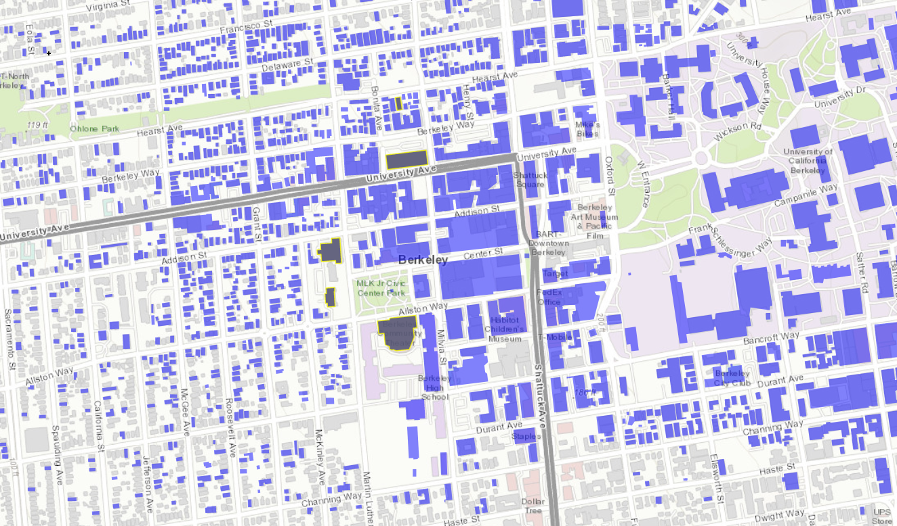

E3 - Physics-based Ground Motions
=================================

+-----------------+--------------------------------------------------------------+
| Download files  | :examplesgithub:`Download <E3PhysicsBasedGroundMotions/>`    |
+-----------------+--------------------------------------------------------------+

This example features ground motion acceleration time histories simulated using the SW4 software and a detailed geophysical model of the San Francisco Bay Area by the Lawrence Livermore National Laboratory (https://doi.org/10.1785/0220180261). The ground motions are used to investigate the impact of a Mw7.0 earthquake on the Hayward fault in the city of Berkeley. Engineering Demand Parameters are simulated with an idealized MDOF building model; building performance is evaluated at the story level based on the HAZUS earthquake damage and loss assessment methodology.

.. note::
   This example uses simulated ground motion time histories from the Lawrence Livermore National Lab. Due to size constraints, only the time histories near Berkeley are bundled with R2D. The complete set of simulated ground motions is available at https://berkeley.box.com/s/65113pqclc2j29ve9alita5kr7q2jnwc . After downloading the zip file, extract its contents to the SW4 folder under input_data.

Modeling Procedure
------------------

We now embark on our journey through the input panels of R2D, making known to the workflow builder how our procedure should be built. An input file that will automatically configure these steps can be downloaded :examplesgithub:`here <E3PhysicsBasedGroundMotions/input.json>`.

#. **VIZ** The following snapshot of the visualization panel shows the assets which have been configured for this study, and their locations on a map of Berkeley, CA.

   .. figure:: figures/r2dt-0003-VIZ.png
      :width: 600px
      :align: center

#. **GI** The following figure shows how the general information panel is configured to handle the units of our analysis and provide output corresponding to demand parameters, damage measures, and decision variables.

   .. figure:: figures/r2dt-0003-GI.png
      :width: 600px
      :align: center

#. **HAZ** Next, in the hazard panel, the :examplesgithub:`EventGrid.csv </E3PhysicsBasedGroundMotions/input_data/SW4_filtered/EventGrid.csv>` file is loaded pointing to the suite of SW4 ground motions which are used for the procedure.

   .. figure:: figures/r2dt-0003-HAZ.png
      :width: 600px
      :align: center

#. **ASD** Now a few buildings of interest can be singled out from the building inventory as shown in the following figure where the **CSV to BIM** option is selected as our backend.

   .. figure:: figures/r2dt-0003-ASD.png
      :width: 600px
      :align: center

#. **HTA** Next, a hazard mapping algorithm is specified using the **Nearest Neighbor** method and the **SimCenterEvent** application, which are configured as shown in the following figure with **4** samples in **3** neighbors.

   .. figure:: figures/r2dt-0003-HTA.png
      :width: 600px
      :align: center

#. **MOD** Now the building modeling procedure is configured with the **MDOF-LU** backend where standard deviations of :math:`0.1` for stiffness and damping are defined.

   .. figure:: figures/r2dt-0003-MOD.png
      :width: 600px
      :align: center

#. **ANA** In the analysis panel, **OpenSees** is selected from the primary dropdown.

   .. figure:: figures/r2dt-0003-ANA.png
      :width: 600px
      :align: center

#. **DL**  The damage and loss panel is now used to configure the **Pelicun3** backend. The **HAZUS MH EQ Story** damage and loss method is selected and configured as shown in the following figure.

   .. figure:: figures/r2dt-0003-DL.png
      :width: 600px
      :align: center

#. **UQ** Now nearing the end of our journey, it is time to configure the venerable **Dakota** uncertainty quantification engine to carry out our Latin Hypercube Sampling (LHS) procedure **10** samples and an arbitrary seed for reproducibility.

   .. figure:: figures/r2dt-0003-UQ.png
      :width: 600px
      :align: center

#. **RV** For the problem at hand we elect to decline the services of the random variable panel and proceed to our journey's end with a swift click of the **Run** button.

