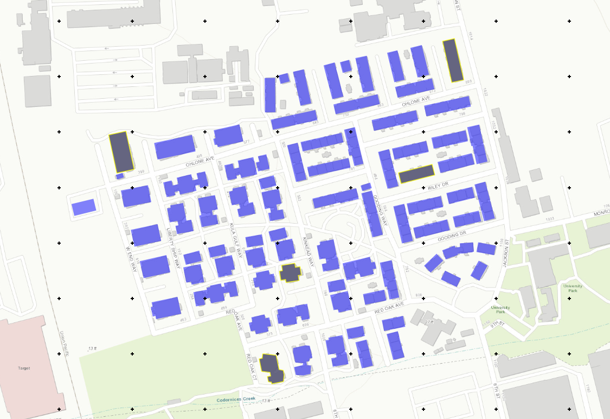

E4 - OpenSeesPy FEM
===================

+-----------------+----------------------------------------------------+
| Download files  | :examplesgithub:`Download <E4OpenSeesPyFEM/>`      |
+-----------------+----------------------------------------------------+

Advanced response estimation is enabled in this example through custom scripts that generate a finite element model for a building using the information available in the building inventory. A template script is provided that creates a building-specific cantilever and performs the response-history analysis to obtain EDPs. The hazard is described by empirical ground motion records from the PEER NGA West2 database. The buildings are located in Albany, CA, and their damage and loss assessment is based on the HAZUS methodology. This example includes 81 buildings and 5 are selected for analysis.

ts of interest. The overall layout suggests a detailed city map for navigation or urban planning purposes.
   :align: center
   

Required Files
--------------

#. :examplesgithub:`cantilever_light.py <E4OpenSeesPyFEM/input_data/model/cantilever_light.py>`
   This Python script defines the following functions which use OpenSeesPy to construct a structural model.

   .. automodule:: cantilever_light
      :members:

Modeling Procedure
------------------

This example is a small-scale regional earthquake risk assessment which performs response simulation and damage/loss estimation for a group of 20 wood buildings under a pseudo earthquake scenario. The procedure for this example can be configured through the R2D interface by sequentially entering the following parameters into the respective panels:

#. **VIZ** The visualization pane shows the assets and ground motion grid.

   .. figure:: figures/r2dt-0004-VIZ.png
      :width: 600px
   :alt: Screenshot of a geographic information system (GIS) application displaying a detailed street map. The map focuses on a region labeled "USDA Western Regional Research Center", with surrounding streets and buildings. Certain buildings are highlighted in yellow, possibly to indicate selection or relevance. Various toolbars and menus within the GIS application show mapping tools and layer options such as Ground Motion, Buildings, and Open Street Map. The user interface also includes browser-like features, a spatial bookmarks section, and different base map options, as well as options to identify and select geographic assets on the map.
      :align: center

#. **GI** Next, the general information panel is used to broadly characterize the problem at hand. In this example, the imperial force and length units are used, and we're interested in the building engineering demand parameters (e.g., peak story drift ratio, peak floor acceleration), damage measures, and the resulting decision variable (e.g., expected replacement cost).

   .. figure:: figures/r2dt-0004-GI.png
      :width: 600px
   :alt: Screenshot of a user interface for a software application, showing various input fields and options. The section 'General Information' includes an 'Analysis Name' field with the entry "E4 - OpenSeesPy FEM". Under 'Units', there are options for 'Force' (selected as Kips), 'Length' (selected as Feet), and 'Time' (selected as Seconds). 'Asset Layers' includes checkboxes with 'Buildings' checked, and options for Soil, Gas Network, Water Network, Waste Network, and Transportation Network. In 'Output Settings', checkboxes for 'Engineering demand parameters (EDP)', 'Damage measures (DM)', 'Decision variables (DV)', 'Output EDP, DM, and DV every sampling realization', 'Output Asset Information Model (AIM)' and 'Output site IM' are checked. On the left side, there is a vertical menu with acronyms such as VIZ, GI, HAZ, ASD, HTA, MOD, ANA, DL, UQ, RV, and RES, indicating different sections or modules of the software.
      :align: center

#. **HAZ** Now in the hazard panel, the **User Specified Ground Motions** option is selected which allows for the use of pre-generated earthquake scenarios. The following figure shows the relevant example files which are now entered in this pane. These ground motion records are selected for stations in a grid.

   .. figure:: figures/r2dt-0004-HAZ.png
      :width: 600px
   :alt: Screenshot of a software interface with a "Hazard Selection" section that includes options for "User Specified Ground Motions." It lists fields for event file and folder containing motions with directory paths provided. On the left is a vertical navigation menu with items such as VIZ, GI, HAZ, ASD, HTA, MOD, ANA, DL, UQ, RV, and RES highlighted in blue.
      :align: center

#. **ASD** In the asset definition panel, the path to the ``input_params.csv`` file is specified. Once this file is loaded, the user can select which particular assets will be included in the analysis by entering a valid range in the form and clicking **Select**. The ``input_params.csv`` includes parameters for the damage and loss assessment (i.e., number of stories, year of built, occupancy class, structure type, plan area, and replacement cost) are specified.

   .. figure:: figures/r2dt-0004-ASD.png
      :width: 600px
   :alt: Screenshot of a 'Regional Building Inventory' spreadsheet interface with a table containing columns labeled id, Latitude, Longitude, NumberOfStories, YearBuilt, OccupancyClass, StructureType, PlanArea, and Replacement. The table displays rows of data with building information such as latitude, longitude, the number of stories, year built, and occupancy class, all corresponding to various asset IDs. The interface includes buttons for exporting data as CSV, browsing asset files, and filtering options.
      :align: center

#. **HTA** Next, a hazard mapping algorithm is specified using the **Nearest Neighbor** method and the **SimCenterEvent** application, which are configured as shown in the following figure with **5** samples in **4** neighbors, i.e., randomly sampling 5 ground motions from the nearest four stations (each station has a set of records specified in the **HAZ**).

   .. figure:: figures/r2dt-0004-HTA.png
      :width: 600px
   :alt: Screenshot of a software interface related to hazard mapping. The section displayed is titled "Hazard to Local Asset Event" and includes two subsections, "Regional Mapping" with options to select a "Mapping Application" set to 'Nearest Neighbour', input fields for "Number of samples" with a value of 5, and "Number of neighbors" with a value of 4. Below is the "Local Mapping" section, which includes "Local Event Type" set to 'SimCenterEvent', and fields for "Event Units" with 'Gravitational constant (g)' and "Event Type" with 'Earthquake'. The interface also has a vertical navigation bar with various tabs, like VIZ, GI, HAZ, ASD, and more, with HTA currently highlighted.
      :align: center

#. **MOD** In the modeling panel, the ``cantilever_light.py`` file is specified in the **Input Script** field and a DOF scheme is defined as shown in the following figure. This example uses the OpenSeesPyInput modeling application. The buildings are modeled as elastic-perfectly plastic single-degree-of-freedom (SDOF) systems defined by three input model parameters: the weight, yield strength, and fundamental period.

   .. figure:: figures/r2dt-0004-MOD.png
      :width: 600px
   :alt: Screenshot of a software interface for "Building Modeling" featuring the OpenSeesPy Script Generator. The interface includes fields for "Input Script", "DOF Mapping", "Analysis Spatial Dimensions", and "Number Nodal DOF". A file path is shown in the Input Script field and values are entered into the other fields. The sidebar on the left has items labeled "VIZ", "GI", "HAZ", "ASD", "HTA", "MOD" (highlighted), "ANA", "DL", "UQ", "RV", and "RES", indicating different modules or sections within the software.
      :align: center

#. **ANA** In the analysis panel, **OpenSeesPy** is selected from the primary dropdown.

   .. figure:: figures/r2dt-0004-ANA.png
      :width: 600px
   :alt: Screenshot of an interface with a vertical menu on the left side, showing various abbreviated options such as VIZ, GI, HAZ, ASD, HTA, MOD, with the option ANA highlighted in a different color. The main area of the interface has a header titled "Building Analysis Engine" with the additional text "OpenSeesPy" indicating the use of the OpenSeesPy library or module in the context of the interface, which might be related to structural analysis or engineering. The rest of the main area is blank.
      :align: center

#. **DL** The damage and loss panel is now used to configure the **Pelicun3** backend. The **HAZUS MH EQ Story** damage and loss method is selected and configured as shown in the following figure:

   .. figure:: figures/r2dt-0004-DL.png
      :width: 600px
   :alt: Screenshot of a user interface titled "Building Damage & Loss Application" with an open tab named "Pelican Damage and Loss Prediction Methodology". The interface includes options for selecting a damage and loss method, with "HAZUS MH EQ Story" selected, toggling event time on or off, setting the number of realizations, and options to output detailed results, log file, coupled EDP, or include ground failure. Some options like "Log file" and "Coupled EDP" are checked, whereas others are not. On the left side, there is a vertical navigation menu with selected options such as VIZ, GI, HAZ, among others, with the current selection on DL. The overall color scheme is a combination of light blue, grey, and white.
      :align: center
	  
#. **UQ** In the UQ panel **Dakota** uncertainty quantification engine is employed to carry out Latin Hypercube Sampling (LHS) with **5** samples and an arbitrary seed for reproducibility.

   .. figure:: figures/r2dt-0004-UQ.png
      :width: 600px
   :alt: Screenshot of a software interface titled 'UQ Application' with 'Dakota' indicated in a text box. The interface includes options for 'Method', 'Number of Samples', and 'Seed', with 'LHS' selected as a method, '5' as the number of samples, and '986' as the seed. There's also a checkbox labeled 'Keep Samples', which is checked. On the left side, there's a vertical menu with abbreviations like 'VIZ', 'GI', 'HAZ', and others, with 'UQ' highlighted in blue, suggesting it's the selected category. The overall color scheme is shades of gray, except for the highlighted 'UQ' button and the top bar with the title.
      :align: center

#. **RV**

   The random variable panel will be left empty for this example.

#. **RES** The analysis outputs for the selected buildings are shown in the figure below.

   .. figure:: figures/r2dt-0004-RES.png
      :width: 600px
   :alt: Screenshot of a user interface presenting a Regional Results Summary, which includes a disclaimer stating that the simulation results are not representative of individual buildings’ responses and advises consulting with a professional structural engineer. The left side of the interface shows layered options such as "Most Likely Critical Da[maged]" with numbered color codes, "Results," "Ground Motion Grid," "Buildings," and "Open Street Map" checkboxes. The main section displays a detailed map with color-coded buildings indicating varying levels of likely critical damage, streets labeled with names like "Ohlone Avenue," and areas marked as "USDA Western Regional Research Center" and "University Village." Various interface elements and a palette of map navigation tools are visible.
      :align: center

