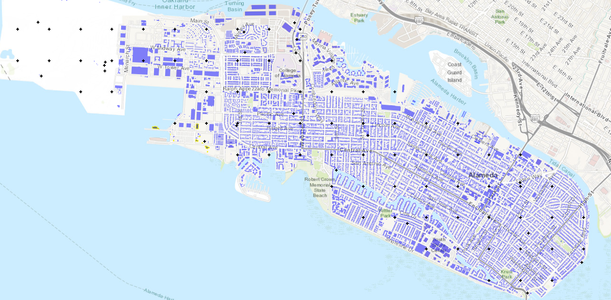

E5 - Ground Shaking and Liquefaction
====================================

+-----------------+-----------------------------------------------------------------+
| Download files  | :examplesgithub:`Download <E5GroundShakingAndLiquefaction/>`    |
+-----------------+-----------------------------------------------------------------+

This example presents a coupled damage assessment for ground shaking and liquefaction hazards. To infer liquefaction, estimates of horizontal spreading and vertical settlement are generated from PGA values obtained through PSHA. These three intensity measures form the basis of input to a building-level, HAZUS-based damage and loss assessment that accounts for potential collapses due to liquefaction. Approximately 14,000 buildings are considered in the city of Alameda, CA.

ata entries. The map is flanked by bodies of water on two sides and displays the layout of what appears to be a coastal city.
   :align: center

#. **VIZ** This example shows a simulation for pseudo-earthquake scenarios. The damage and loss of a sample of buildings in Alameda County due to the soil liquefaction are estimated.  The results presented herein are only for demonstrating the use of R2DTool and do not serve as an accurate representation of the real losses.

   .. figure:: figures/r2dt-0005-VIZ.png
      :width: 600px
   :alt: Screenshot of a geographic information system (GIS) software interface displaying a map of the San Francisco Bay Area with various layers, such as buildings and ground motion, visible. The left panel shows a list of data layer options, and the top toolbar contains numerous GIS tools. The map highlights sections of the city with different colors, possibly indicating varying data points or analysis results.
      :align: center

#. **GI** Next, the general information panel is used to broadly characterize the problem at hand. In this example, the imperial force and length units are used, and we're interested in the engineering demand parameters, damage measures, and the resulting decision variable (e.g., expected replacement cost).

   .. figure:: figures/r2dt-0005-GI.png
      :width: 600px
   :alt: Screenshot of a software interface for engineering or hazard analysis with a menu on the left side featuring options like VIZ, GI, HAZ, and others. The main pane titled "General Information" displays an "Analysis Name" field with "E5 - Ground Shaking + Liquefaction" entered. Below, under "Units," there are selections for Force (Kips), Length (Inches), and Time (Seconds). Further down under "Asset Layers," Buildings is checked among other unchecked layers like Soil and Gas Network. In the "Output Settings" section, various options like "Engineering demand parameters (EDP)" and "Damage measures (DM)" are checked. The interface appears to be used for setting up and running a simulation or analysis related to civil engineering or risk assessment.
      :align: center

#. **HAZ** Now in the hazard panel, the **User Specified Ground Motions** option is selected which allows for the use of pre-generated earthquake scenarios. The following figure shows the relevant example files which are now entered in this pane. The peak ground acceleration and peak ground deformation (in both the horizontal and vertical directions) are used as intensity measures to quantify the potential earthquake effects.

   .. figure:: figures/r2dt-0005-HAZ.png
      :width: 600px
   :alt: Screenshot of a computer interface with a section titled "Hazard Selection" with the option "User Specified Ground Motions" selected. There are two file path fields displayed: "Event File Listing Motions" and "Folder Containing Motions", each with a corresponding 'Browse' button. A vertical navigation menu on the left side has various options, highlighted option is "HAZ", along with others like "VIZ", "GI", "ASD", "HTA", "MOD", "ANA", "DL", "UQ", "RV", "RES" in a dark sidebar. The overall theme is minimal and functional.
      :align: center

#. **ASD** In the asset definition panel, the path to the ``all_bldgs.csv`` file is specified. Once this file is loaded, the user can select which particular assets will be included in the analysis by entering a valid range in the form and clicking **Select**. For this example, the range **1-20** is used to include all buildings. The ``input_params.csv`` includes parameters for the damage and loss assessment (i.e., number of stories, year of built, occupancy class, structure type, plan area, replacement cost, population, and soil type).

   .. figure:: figures/r2dt-0005-ASD.png
      :width: 600px
   :alt: Screenshot of a computer interface showing the "Regional Building Inventory" with a table listing building asset information. Columns include "id," "Latitude," "Longitude," "Number Of Stories," "Year Built," "Occupancy Class," "StructureType," "PlanArea," and "Replacement Cost." The table appears to display data for buildings, with each row representing a unique asset, showing their location coordinates, story count, year of construction, type classification, and additional details. The interface includes options for exporting data and applying advanced filters.
      :align: center

#. **HTA** Next, a hazard mapping algorithm is specified using the **Nearest Neighbor** method and the **SimCenterEvent** application, which are configured as shown in the following figure with **1000** samples in **4** neighbors.

   .. figure:: figures/r2dt-0005-HTA.png
      :width: 600px
   :alt: Screenshot of a user interface with a sidebar on the left and a form titled "Building Mapping" on the right. The sidebar contains vertically listed menu options such as VIZ, GI, HAZ, ASD, with HTA highlighted in turquoise. The form on the right includes a dropdown menu with "Nearest Neighbour" selected, and input fields labeled "Number of samples" with a value of 1000, "Number of neighbors" with a value of 4, and "Seed" with a value of 10. The form has a clean and simple design with a light background.
      :align: center

#. **MOD** In the building modeling panel, simply leave the first dropdown box set to **None**.

   .. figure:: figures/r2dt-0005-MOD.png
      :width: 600px
   :alt: Screenshot of a software interface showing a sidebar menu on the left with various abbreviated options like VIZ, GI, HAZ, and the selected option MOD highlighted in teal. To the right, there is a larger panel with the title "Building Modeling" and a dropdown menu indicating "None." The rest of the interface is empty, suggesting it's a template or a work in progress.
      :align: center
	  
#. **ANA** In the analysis panel, **IMasEDP** is selected from the primary dropdown.

   .. figure:: figures/r2dt-0005-ANA.png
      :width: 600px
   :alt: Screenshot of a software interface with a vertical menu on the left with labels like VIZ, GI, HAZ, ASD, HTA, MOD, ANA (highlighted), DL, UQ, RV, and RES. The top of the screen has a title "Building Analysis Engine" beside the logo "IMasEDP," with some toolbar icons toward the right. The rest of the interface is mostly empty with a gray background.
      :align: center

#. **DL** The damage and loss panel is now used to configure the **Pelicun3** backend. The **HAZUS MH EQ IM** damage and loss method is selected and configured as shown in the following figure:

   .. figure:: figures/r2dt-0005-DL.png
      :width: 600px
   :alt: Screenshot of a user interface for a "Building Damage & Loss Application" with a section titled "Pelican Damage and Loss Prediction Methodology." Options include a dropdown menu for "Damage and Loss Method" set to "HAZUS MH EQ IM," a toggle for "Event time" set to off, an input field for "Number of realizations" with the number 1000, and checkboxes for "Output detailed results," "Log file," "Coupled EDP," and "Include ground failure," with the latter three currently checked. On the left side, there is a vertical navigation bar with various tabs, with the "DL" tab highlighted, indicating the current section.
      :align: center

#. **UQ** For this example the **UQ** dropdown box should be set to **None**.

   .. figure:: figures/r2dt-0005-UQ.png
      :width: 600px
   :alt: Screenshot of a user interface with a vertical navigation panel on the left side, showing a list of abbreviated menu options such as VIZ, GI, HAZ, ASD, HTA, MOD, ANA, DL, UQ (highlighted in blue), RV, and RES. On the top right, there is a header titled "UQ Application" with a dropdown menu set to "None" and an icon that appears to be a settings or options button. The overall color scheme is muted with dark and light grays.
      :align: center

#. **RV**

   The random variable panel will be left empty for this example.

#. **RES** The analysis outputs for the selected 10 buildings are shown in the figure below.

   .. figure:: figures/r2dt-0005-RES.png
      :width: 600px
   :alt: A screenshot of a computer interface showing a detailed map-based analysis tool. The main section of the screen displays a regional map with geospatial data overlay, focusing on a coastal area with annotations representing buildings, roads, and possibly seismic or critical infrastructure data. There are checkboxes for layers such as "Most Likely Critical Damage," "Results," "Ground Motion Grid," "Buildings," and "Open Street Map." There's a disclaimer at the top indicating that simulation results are not representative of individual building responses and should not be used for predictions about a specific building's safety or damage state. The interface includes a sidebar with various menu options like VIZ, GI, HAZ, and others, as well as a selected "Buildings" heading highlighted in blue.
      :align: center
